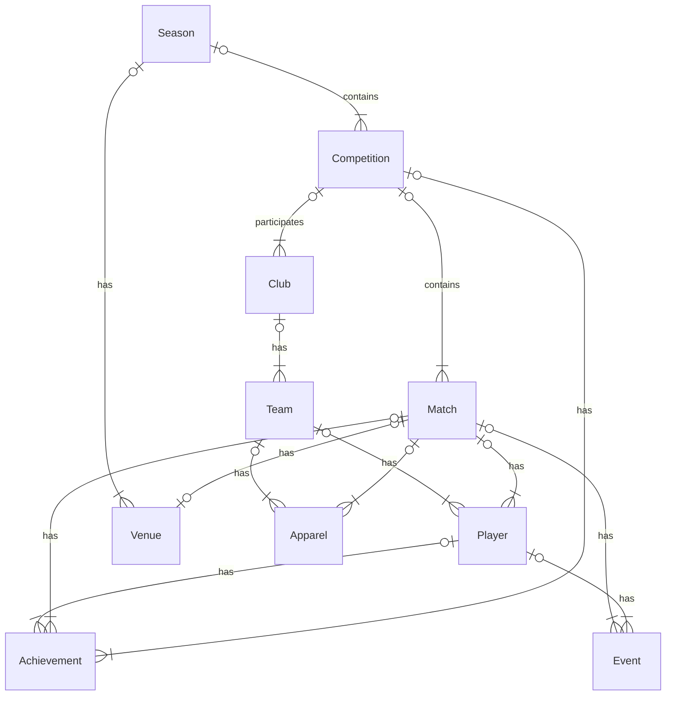

# Billing Giants

## Overview

This application provides a mechanism to search and review historical ice hockey matches. It permits users to add comments, videos, pictures of matches and check-in if they attended.

## Problem Definition

Currently if you are a Ice Hockey fan, it's difficult to review historical results in a granular way. Often when trying to understand the outcome of a match, other than the final scores it's difficult to understand how the match progressed and who scored etc. There is a need for searching through historical match and breaking down the match into players, injuries, fights, penalties, goals, MVPs and worn jerseys.

## Target Audience
The users for this application would be ice hockey fans and content administrators.

## Requirements

MoSCoW prioritization, also known as the MoSCoW method or MoSCoW analysis, is a popular prioritization technique for managing requirements. M - Must have, S - Should have, C - Could have, W - Will not have.

### Must Have

- A user must be able to search for an match.
- A user must be able to see the outcome of a match.
- A user must be able to see the events that took place during a match.
- A user must be able to see the players for a match.
- A user must be able to see the venue for the match.
- An administrator can add a new match

### Should Have
- A user could able to see the substitutions that took place for a match.

### Could Have
- A user should be able to see the jerserys that were worn for a match.
- A user should be able to check-in for a match.
- A user could upload their videos and pictures for a match.
- The system could automatically retrieve the content from a match

### Will Not Have

- A user can book tickets for a match.
- A user can get real-time updates from an ongoing live match.

## Domain Model Diagram

## Entity Relationship Diagram

## API Specifications

- Seasons
  - Get All
  - Get Single
  - Create
  - Update
  - Delete

- Seasons/{seasonId}/Competitions
  - Get All
  - Get Single
  - Create
  - Update
  - Delete

- Clubs
  - Get All
  - Get Single
  - Create
  - Update
  - Delete

- Competitions/{competitionID}/Matches
  - Get All
  - Create
  - Get Single
  - Update
  - Delete

- Clubs/{clubID}/Teams
  - Get All
  - Get Single
  - Create
  - Update
  - Delete

- Venues
  - Get Single
  - Create
  - Update
  - Delete

- Players
  - Get All
  - Get Single
  - Create
  - Update
  - Delete

- Teams/{TeamId}/player
  - Create
  - Delete
  - Update

- Competitions/{competitionID}/Achievements
  - Get All
  - Get Single
  - Create
  - Update
  - Delete

- Match/{MatchId}/Events
  - Get All
  - Get Single
  - Create
  - Update
  - Delete